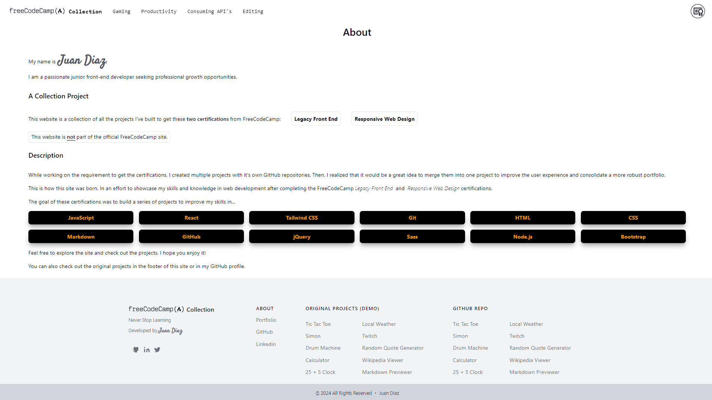
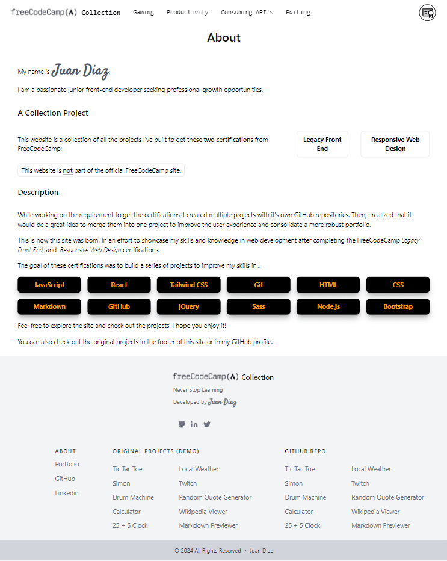
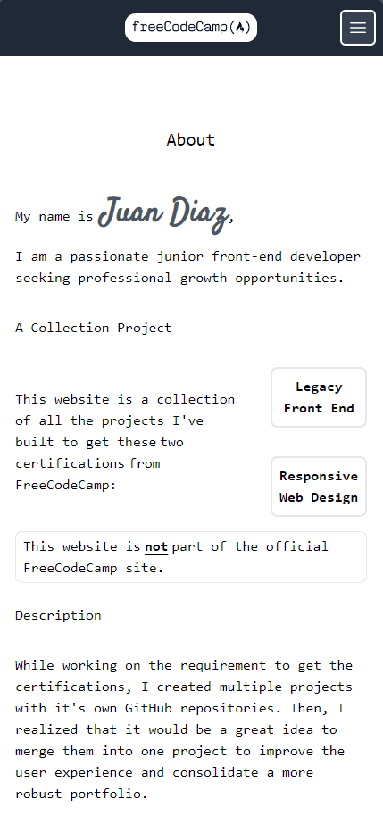
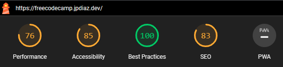

<div id="top"></div>

# FreeCodeCamp Collection Projects 📚

Embark on my journey through **[freeCodeCamp’s legacy Front End Development Certification!](https://www.freecodecamp.org/certification/1diazdev/legacy-front-end)** These projects showcase my growth in HTML, CSS, JavaScript, Bootstrap, jQuery, Sass, React, Node.js, Git, and GitHub. From mastering responsive design with Bootstrap to building interactive functionalities with React, each project reflects my dedication for learning and experimentation.

While working on the requirements to obtain the certifications, I created multiple projects, each with its own GitHub repository and website. However, I wasn't satisfied with the result. After some time, I realized that merging them into a single repository would be a great idea. This project was thus conceived, aiming to improve user experience and consolidate a more robust portfolio.

<div align="center">

[](https://freecodecamp.jpdiaz.dev/)
[](https://stackblitz.com/github.com/JuanPabloDiaz/freecodecamp)

</div>

In this repository, you'll find the following projects to explore:

- **Tic Tac Toe** ( [View Demo](https://tictactoe.jpdiaz.dev/) | [View Code](https://stackblitz.com/github.com/JuanPabloDiaz/ticTacToe) ): A classic game of Tic Tac Toe with a twist: players can choose to play against a computer.
- **Simon Game** ( [View Demo](https://simon.jpdiaz.dev/) | [View Code](https://stackblitz.com/github.com/JuanPabloDiaz/simonGame) ): A memory game that challenges players to remember a sequence of colors and sounds.
- **Drum Machine** ( [View Demo](https://drum.jpdiaz.dev/) | [View Code](https://stackblitz.com/github.com/JuanPabloDiaz/drumMachine) ): A drum machine that allows users to play sounds by pressing keys or clicking buttons.
- **Calculator** ( [View Demo](https://math.jpdiaz.dev/) | [View Code](https://stackblitz.com/github.com/JuanPabloDiaz/calculator) ): A simple calculator that performs basic arithmetic operations.
- **Pomodoro Clock** ( [View Demo](https://25.jpdiaz.dev/) | [View Code](https://stackblitz.com/github.com/JuanPabloDiaz/25-5_clock) ): A productivity timer that helps users stay focused and productive.
- **Local Weather** ( [View Demo](https://weather.jpdiaz.dev/) | [View Code](https://stackblitz.com/github.com/JuanPabloDiaz/weather) ): A local weather app that displays the weather in the user's current location by using the Geolocation API.
- **Twitch.tv JSON API** ( [View Demo](https://twitch.jpdiaz.dev/) | [View Code](https://stackblitz.com/github.com/JuanPabloDiaz/twitch): A Twitch.tv JSON API that displays the status of several Twitch.tv channels by using the Twitch.tv JSON API.
- **Random Quote Generator** ( [View Demo](https://quote.jpdiaz.dev/) | [View Code](https://stackblitz.com/github.com/JuanPabloDiaz/random-quote-generator) ): A random quote generator that displays quotes from famous people by consuming an API.
- **Wikipedia Viewer** ( [View Demo](https://wiki.jpdiaz.dev/) | [View Code](https://stackblitz.com/github.com/JuanPabloDiaz/wikipediaViewer) ): A Wikipedia viewer that allows users to search for articles on Wikipedia or view a random article. It consumes the Wikipedia API.
- **Markdown Previewer** ( [View Demo](https://markdown.jpdiaz.dev/) | [View Code](https://stackblitz.com/github.com/JuanPabloDiaz/markdownPreviewer) ): A markdown previewer that converts plain text into HTML. Alowing users to write in markdown and see the output as they type.

Get a glimpse into my technical capabilities and passion for front-end development!

### Desktop View 🖥️



### iPad view 📱



### Mobile view 📱



### Lighthouse Score 🚀



## Features:

- Responsive design: [freecodecamp](https://freecodecamp.jpdiaz.dev) adapts to any screen size, ensuring a consistent and enjoyable experience for all users.
- Sleek and modern UI: Tailwind CSS provides a beautiful and intuitive user interface.
- Efficient and performant: Vite.js ensures fast loading times and a smooth experience.

### Built With 🔑

Welcome to the [freecodecamp](https://freecodecamp.jpdiaz.dev), collection.


Here's a closer look at the tech stack:

- Front-End: React.js, Vite.js, Tailwind CSS
- Back-End: API
- Deployment: Vercel

## Get started 🛠️

To get started with [freecodecamp](https://freecodecamp.jpdiaz.dev), simply clone the repository and follow the setup instructions. You'll be up and running in no time!

### Setup 📋

1. Clone the repo
2. Install dependencies
   ```sh
   npm install
   ```
3. Start the development server
   ```sh
   npm run dev
   ```
4. Open [http://localhost:5173/](http://localhost:5173/) with your browser to see the result.

## Usefull Commands 🧰

- Run before Deploy: `$ npm run build`
- Check for errors: `$ npm run lint`
- Run Prettier: `$ npm run format`
- Run Lighthouse in local: `$ npm run lighthouse`

## Contribution 🤝

All contributions are welcome. Please read the [CONTRIBUTING guidelines](CONTRIBUTING.md) for details on our code of conduct, and the process for submitting pull requests.

### Contributors

<a href="https://github.com/JuanPabloDiaz/freecodecamp/graphs/contributors"></a><!-- Made with [contrib.rocks](https://contrib.rocks). -->

## License 📜

[freecodecamp](https://freecodecamp.jpdiaz.dev) is licensed under the MIT License.

I hope you enjoy using the freecodecamp repo!

<!-- OTHER PROJECTS -->

## Other Projects 🚀


[](https://github.com/JuanPabloDiaz/platzi/tree/main/2021)
[](https://github.com/JuanPabloDiaz/platzi/tree/main/2022)
[](https://github.com/JuanPabloDiaz/platzi/tree/main/2023)

<!-- CONTACT -->

## Contact 📞

[](https://www.linkedin.com/in/1diazdev/)
[](https://www.twitter.com/1diazdev)
[](mailto:juan.diaz93@hotmail.com)

[](https://platzi.com/p/DiazJuan/)

<!-- ACKNOWLEDGMENTS -->

## Acknowledgments 📚

Resources list that I find helpful and would like to give credit to.

- [freeCodeCamp](https://www.freecodecamp.org/)
- [freeCodeCamp Front-end](https://www.freecodecamp.org/learn/front-end-development-libraries/)
- [Tailwind CSS](https://tailwindcss.com/)
- [Vite.js](https://vitejs.dev/)
- [React.js](https://reactjs.org/)
- [Vercel](https://vercel.com/)

<p align="right">(<a href="#top">👆 Top 👆</a>)</p>
